

# SE-Assignment-6
 Assignment: Introduction to Python
Instructions:
Answer the following questions based on your understanding of Python programming. Provide detailed explanations and examples where appropriate.

 Questions:

1. Python Basics:
   - What is Python, and what are some of its key features that make it popular among developers? Provide examples of use cases where Python is particularly effective.

**Python** is a high-level, interpreted programming language known for its simplicity and readability.

**Key features of Python**

**Simplicity and Readability:**
 Python's syntax is designed to be clear, concise, and readable. It resembles English-like syntax, which makes it easy to learn and understand, especially for beginners. This simplicity reduces the learning curve and allows developers to focus more on solving problems than on syntax intricacies.

**Versatility:**
 Python is a general-purpose programming language, meaning it can be used for a wide variety of applications. Whether you're developing web applications, scientific computing tools, data analysis scripts, artificial intelligence models, automation scripts, or even games, Python provides libraries and frameworks that support these diverse needs.

**Large Standard Library:** 
Python comes with a comprehensive standard library that provides modules and packages for common programming tasks like file I/O, networking, data manipulation, regular expressions, and more. This eliminates the need for developers to write code from scratch for basic functionalities, saving time and effort.

**Extensive Third-Party Libraries and Frameworks:**
 Python has a rich ecosystem of third-party libraries and frameworks that extend its capabilities for specific domains and tasks. For example, NumPy and pandas for data manipulation and analysis, Django and Flask for web development, TensorFlow and PyTorch for machine learning, Matplotlib and Seaborn for data visualization, and so on. This vast collection of libraries allows developers to leverage existing solutions and accelerate development.

**Community and Support:** 
Python has a large and active community of developers worldwide. This community contributes to the language's growth by creating libraries, frameworks, and tools, as well as providing support through forums, online communities, conferences, and workshops. The strong community ensures that developers can find solutions to problems quickly and stay updated with the latest developments in the language.

**Portability:**
Python is platform-independent, meaning Python code can run on various operating systems (Windows, macOS, Linux) with minimal or no modifications. This portability is advantageous for deploying applications across different environments and systems.

**Integration Capabilities:** Python can easily integrate with other languages and technologies, making it a preferred choice for building complex systems that require interoperability. It supports integration with C/C++, Java, .NET, and other languages through libraries and APIs.

**Scalability:**
Python's design and ecosystem support scalable development, allowing projects to grow from small scripts to large applications seamlessly. It offers tools and practices for structuring code, managing dependencies, and maintaining code quality, facilitating long-term maintainability and scalability.

**Open Source and Free:**
 Python is developed under an OSI-approved open-source license, which means it is freely available for anyone to use, modify, and distribute. This openness encourages collaboration, innovation, and adoption by a wide range of organizations and individuals.

**Examples of use cases where Python is particularly effective.**

**Web Development:**
*Frameworks like Django and Flask:* Python is widely used for building web applications due to its ease of use and powerful frameworks.
*Data Science and Machine Learning:* Libraries like NumPy, pandas, SciPy, scikit-learn, TensorFlow, and *PyTorch:* Python is the language of choice for data scientists and machine learning practitioners.

**Scientific Computing:**
SciPy and libraries for computational physics, chemistry, biology, etc.: Python, along with libraries like SciPy, provides powerful tools for scientific computing. Researchers use Python for simulations, data analysis, visualization, and modeling in various scientific disciplines.

**Automation and Scripting:**
Automating repetitive tasks, system administration: Python's simplicity and readability make it ideal for writing scripts to automate tasks such as file operations, data parsing, scheduling, and system administration across different platforms.

**Web Scraping:**
Beautiful Soup, Scrapy: Python is commonly used for web scraping due to libraries like Beautiful Soup and Scrapy, which make it easy to extract data from websites and APIs. This is valuable for gathering information for data analysis, research, and monitoring.

**Game Development:**
*Pygame:* Python can be used for game development, particularly with libraries like Pygame, which provide tools and modules for creating interactive games and multimedia applications.

2. Installing Python:
   - Describe the steps to install Python on your operating system (Windows, macOS, or Linux). Include how to verify the installation and set up a virtual environment.

**Steps in Installing Python**

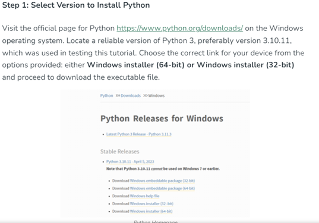
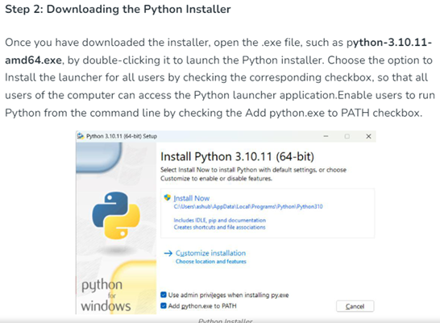
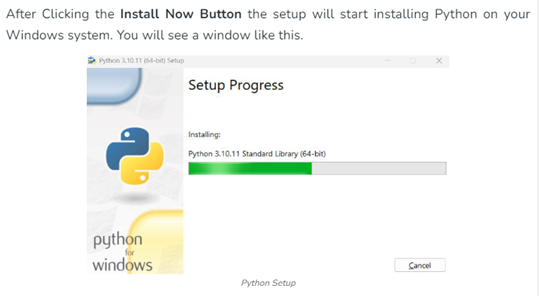
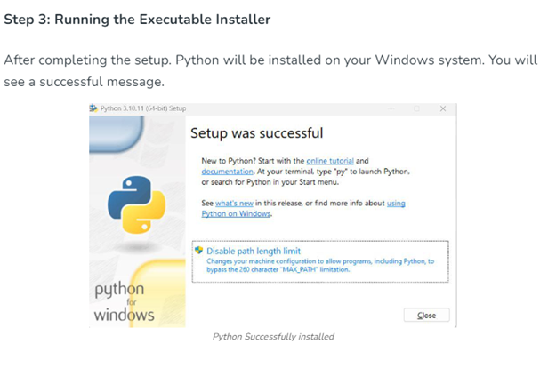
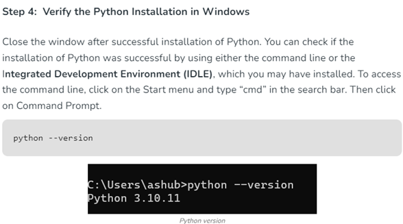

**Setting up a virtual environment using Python**

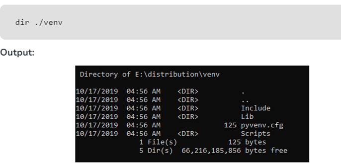
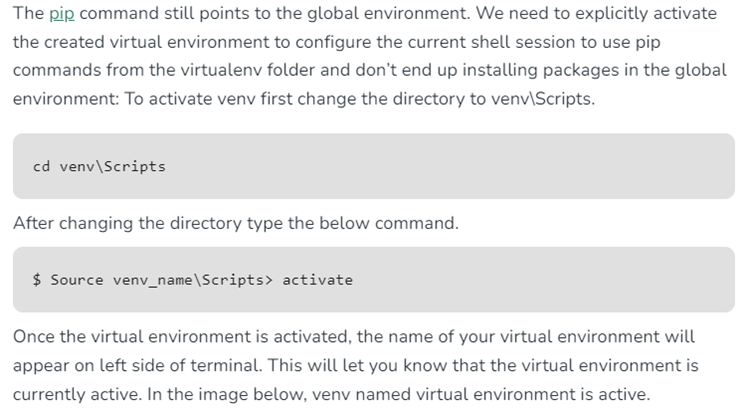
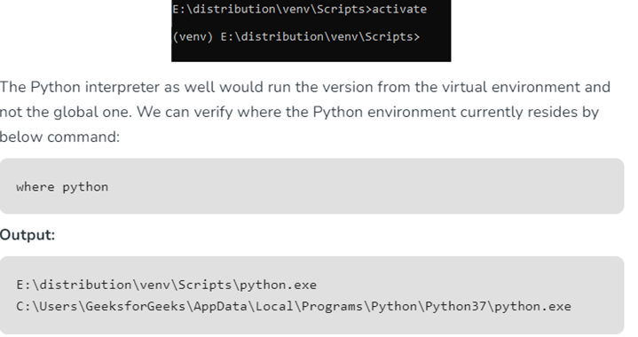
 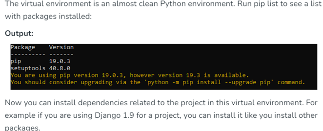 
 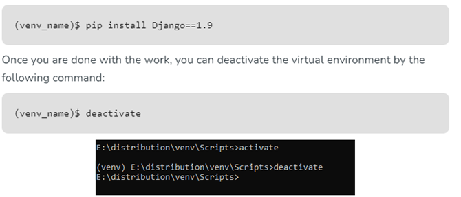 
 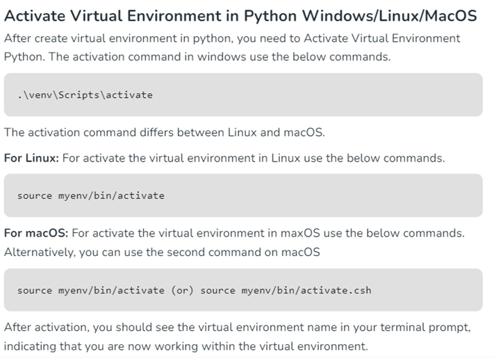

3. Python Syntax and Semantics:
   - Write a simple Python program that prints "Hello, World!" to the console. Explain the basic syntax elements used in the program.

**Python program the prints “Hello, World”**

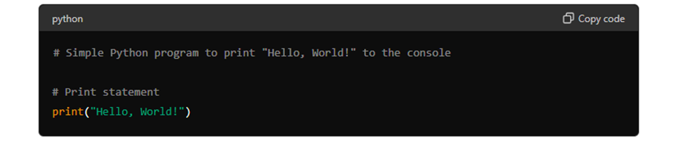

**Explanation of the basic syntax elements used:**

*Comments:*
The line # Simple Python program to print "Hello, World!" to the console is a comment. Comments in Python start with the # symbol and are ignored by the interpreter. They are used to annotate code, providing explanations or notes.

*Print Statement:*
print("Hello, World!") is the core statement that prints the text "Hello, World!" to the console.
print() is a built-in Python function that outputs (prints) a message or value to the console.

*"Hello, World!" is a string literal enclosed in double quotes. In Python, strings are sequences of characters, and they can be enclosed in either single quotes (') or double quotes (").*

4. Data Types and Variables:
   - List and describe the basic data types in Python. Write a short script that demonstrates how to create and use variables of different data types.

**Basic data types of Python**

Integer (int):
Represents whole numbers, both positive and negative.
Example: 42, -10, 0.

Float (float):
Represents decimal numbers.
Example: 3.14, -0.001, 2.0.

Boolean (bool):
Represents truth values, True or False.
Example: True, False.

String (str):
Represents sequences of characters, enclosed within single quotes ' or double quotes ".
Example: 'Hello', "Python", '123'.

NoneType (None):
Represents the absence of a value or a null value.
Example: None.

Python also supports more complex data types that can hold multiple values:
List:
Ordered collection of items, mutable (modifiable).
Example: [1, 2, 3], ['a', 'b', 'c'].

Tuple:
Ordered collection of items, immutable (cannot be changed).
Example: (1, 2, 3), ('a', 'b', 'c').

Dictionary (dict):
Unordered collection of key-value pairs.
Example: {'name': 'Alice', 'age': 30}, {1: 'apple', 2: 'banana'}.

Set:
Unordered collection of unique items.
Example: {1, 2, 3}, {'a', 'b', 'c'}.

5. Control Structures:
   - Explain the use of conditional statements and loops in Python. Provide examples of an `if-else` statement and a `for` loop.

Loops and conditional statements are powerful constructs that allow programmers to automate repetitive tasks and control the flow of their programs based on certain conditions. In this article, we explored for loops, while loops, if statements, and if-else statements in Python with examples.

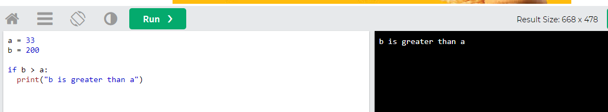
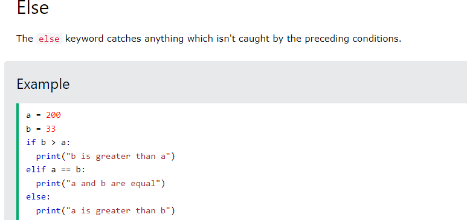
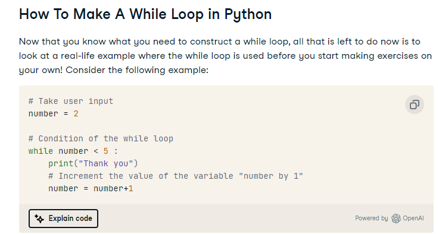

6. Functions in Python:
   - What are functions in Python, and why are they useful? Write a Python function that takes two arguments and returns their sum. Include an example of how to call this function.

**A function** is a block of code which only runs when it is called. You can pass data, known as parameters, into a function. A function can return data as a result.

 **Python function that takes two arguments and returns their sum.**

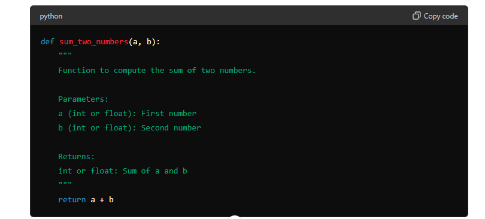
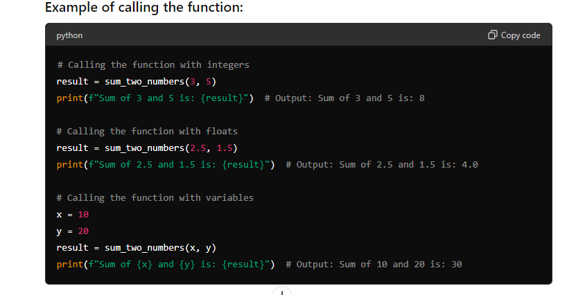

We define a function sum_two_numbers that accepts two parameters a and b.
Inside the function, it simply returns the sum of a and b.
We demonstrate calling the function with different types of arguments (integers and floats), as well as using variables as arguments.

7. Lists and Dictionaries:
   - Describe the differences between lists and dictionaries in Python. Write a script that creates a list of numbers and a dictionary with some key-value pairs, then demonstrates basic operations on both.

**Difference between lists and dictionaries**

Both of these are tools used in the Python language, but there is a crucial difference between List and Dictionary in Python. A list refers to a collection of various index value pairs like that in the case of an array in C++. A dictionary refers to a hashed structure of various pairs of keys and values.

**Demonstration of scripts that create a list of numbers and dictionaries with some key-value pairs**

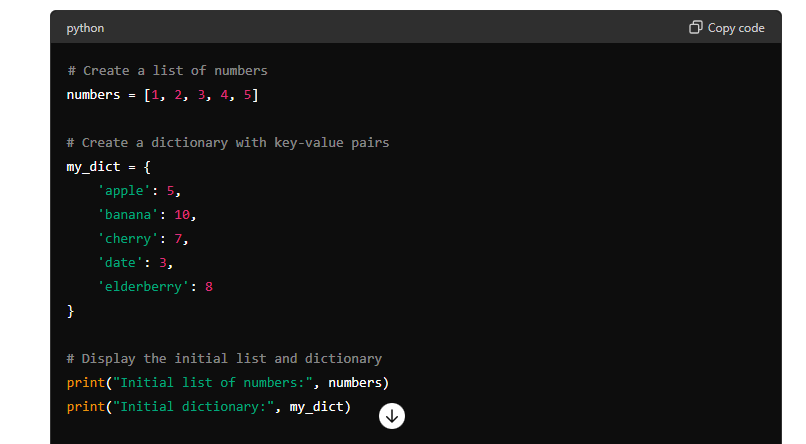
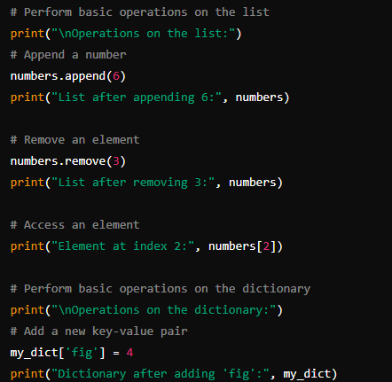
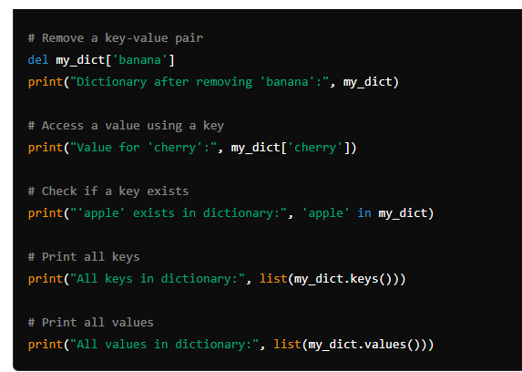

8. Exception Handling:
   - What is exception handling in Python? Provide an example of how to use `try`, `except`, and `finally` blocks to handle errors in a Python script.

All exception-handling blocks in Python begin with the "try" keyword. It is used to check the code for errors. Programmers write only those codes within this block, which might raise an exception. If the code in the try block is error-free, the try block executes, and the subsequent except block is skipped.

**Example of how to use `try`, `except`, and `finally` blocks to handle errors in a Python script.**

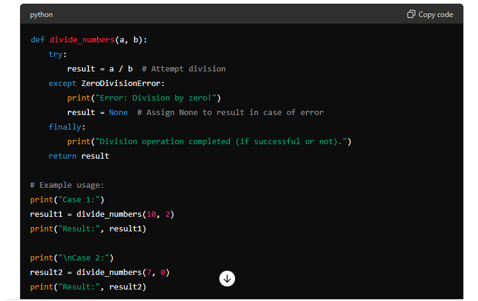

Explanation:
Function Definition: divide_numbers(a, b) is a function that attempts to divide a by b.

try Block: Inside the try block, the division a / b is attempted.

except Block: If a ZeroDivisionError occurs (i.e., division by zero), the except block catches the exception, prints an error message, assigns None to result, and continues execution.

finally Block: This block is executed whether an exception occurs or not. It's typically used for cleanup actions like closing files or releasing resources. Here, it prints a message indicating the completion of the division operation.

Example Usage:

Case 1: divide_numbers(10, 2) performs normal division (10 divided by 2), resulting in 5.0.
Case 2: divide_numbers(7, 0) attempts to divide by zero, which triggers the ZeroDivisionError. The exception is caught, an error message is printed, and None is returned as result.

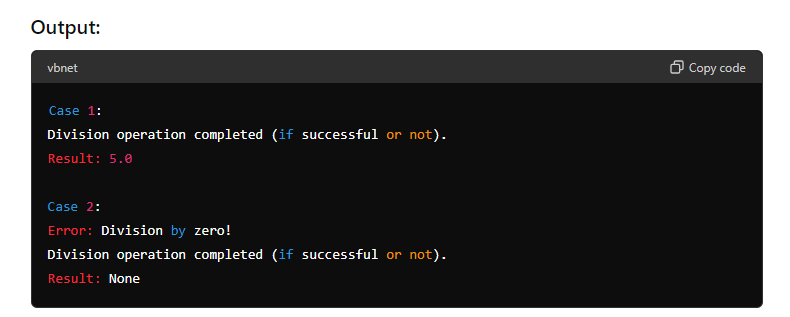

9. Modules and Packages:
   - Explain the concepts of modules and packages in Python. How can you import and use a module in your script? Provide an example using the `math` module.

In Python, both modules and packages organize and structure the code but serve different purposes. In simple terms, a module is a single file containing Python code, whereas a package is a collection of modules that are organized in a directory hierarchy.

Explanation:
Import Statement: import math imports the entire math module into your script. After this statement, you can access all functions and constants defined in the math module using the math. prefix.

Example Usage:

math.sqrt(x): Calculates the square root of x.
math.ceil(sqrt_x): Computes the smallest integer greater than or equal to sqrt_x.
math.floor(sqrt_x): Computes the largest integer less than or equal to sqrt_x.

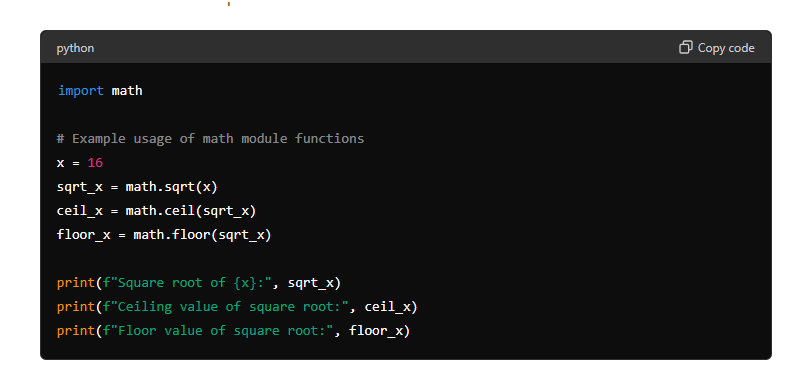
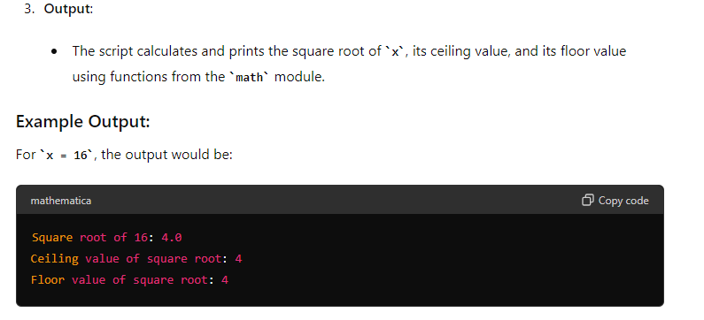

10. File I/O:
    - How do you read from and write to files in Python? Write a script that reads the content of a file and prints it to the console, and another script that writes a list of strings to a file.

Python provides built-in functions for creating, writing, and reading files. Two types of files can be handled in Python, normal text files and binary files (written in binary language, 0s, and 1s).

Text files: In this type of file, Each line of text is terminated with a special character called EOL (End of Line), which is the new line character (‘\n’) in Python by default.
Binary files: In this type of file, there is no terminator for a line, and the data is stored after converting it into machine-understandable binary language.

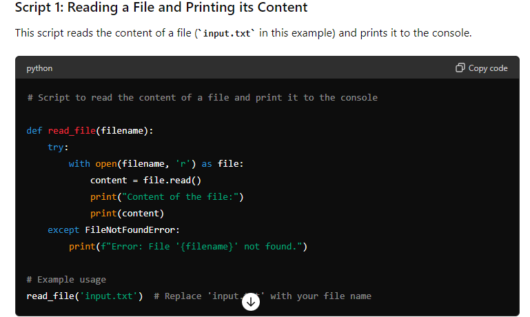
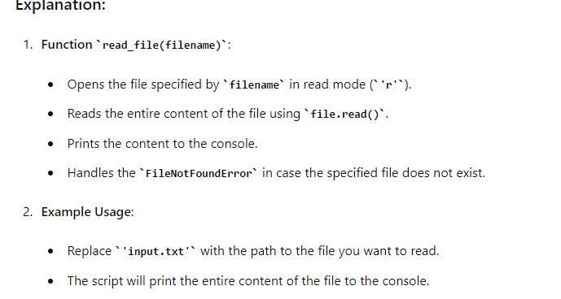
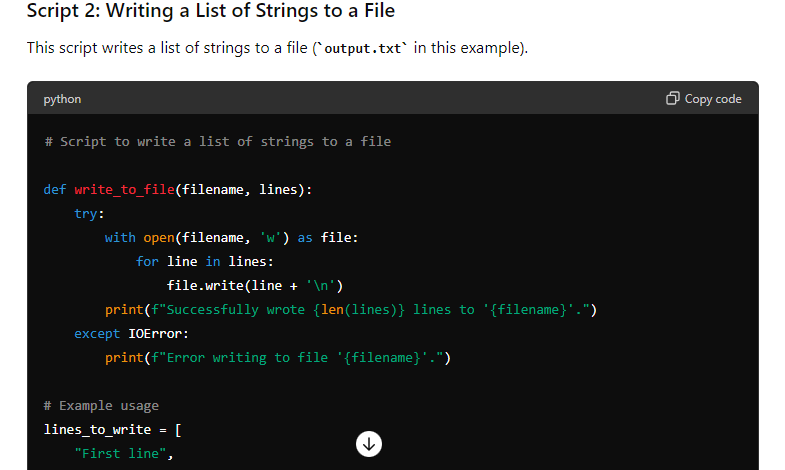
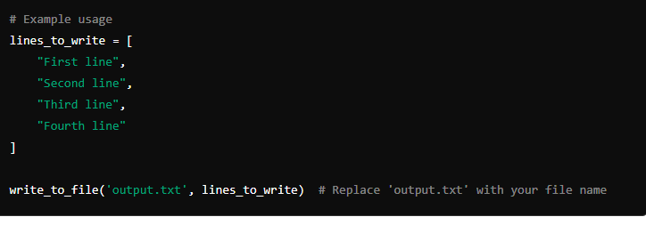

**CITATIONS**
https://www.geeksforgeeks.org/reading-writing-text-files-python/
https://www.w3schools.com/python/trypython.asp?filename=demo_if2
https://chatgpt.com/

# Submission Guidelines:
- Your answers should be well-structured, concise, and to the point.
- Provide code snippets or complete scripts where applicable.
- Cite any references or sources you use in your answers.
- Submit your completed assignment by [due date].

